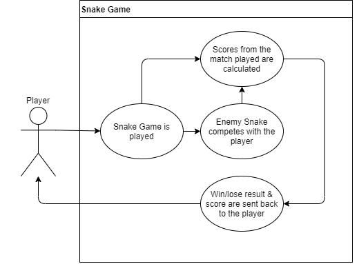

# Improving the Game of 'Snake'
---
### Project Abstraction
From the original creator of the snake game, the github user named 'hexadeciman', this program is "A simple snake game in java. Uses Threads and Java Swing to display the game..." The idea behind choosing this open source project is to improve upon it; adding many features to the game so that the snake game is not simply just the snake moving around the screen and eating from the locations marked. The game is very simple, and the challenge would be for developers to implement many quality-of-life and gameplay features to make this game more of a 'complete' game.

##### Use Case Diagram:

---
### Project Relevance
In accordance with many of subjects listed in slides 8 and 9 in [CIS3296Introduction.pptx](https://templeu.instructure.com/courses/75842/modules/items/2343829), the improvements suggested for this project would allow for a group of students to further their knowledge of project management through the assignment of jobs, roles, and deadlines for the project. It will also allow students to continue to practice version control through Git and Github so that changes can be tracked and accounted for. Upon forking/cloning the repository, developers will build, develop, and test the code either written or already provided. Through the creation of tests for the essential methods of the snake game program, the student developers will be able to track issues without a problem. Broader topics covered through this project are Object oriented design, test driven design, debugging, graphical user interfaces, on-the-fly coding, and unified markup language.

---
### Conceptual Design
The first thing that needs to be done regarding this program is the construction of a class diagram using unified model language so that everyone working on the project knows what methods are attributed to what. Considering that the original program for the snake game is somewhat simple already, developers would add multiple features such as a pause-menu where the player would be able to resume the paused game, restart the game or close the game entirely, a scoring system which uses an algorithm that gives the player increasing increments of points each time the snake eats from the location marked in-game and stores them in some sort of data structure, and a second snake that challenges the player to work faster using a pathfinding algorithm. Adding tests to methods already established in the program along with the new ones that would be added with our improvements would make further upkeep and version contol of the snake game much easier. Although, the primary objective would be to add a menu with the ability to restart the game since the orignal developer indicated that is something that they want implemented into the game.

---
### Background

##### Link to Github Source:
https://github.com/hexadeciman/Snake.git

##### Building:
- Must at least have version 8 of Java SE Development Kit.
- Works with NetBeans 8.2 (Did not attempt to build with earlier versions).
- Make sure the program is within a project on NetBeans
- In the Run menu of NetBeans, simply click "Build Project" (Or press F11 to build).
- First build will take longer than usual, although it will succeed in the end. 

##### Running:
- This program does not contain any test methods so "Test Project" will not run as expected.
- Select "Run Project" from the Run menu in NetBeans and the snake game will begin running (As of right now, there is no way to exit the game without pressing 'X').

##### Run of the Original Program: 

---
### Required Resources
- Knowledge of the Java programming language and it's libraries
- Understanding of multi-threading programming concepts
- Java SE Development Kit 8
- NetBeans IDE 8.2 (or any other Java IDE)